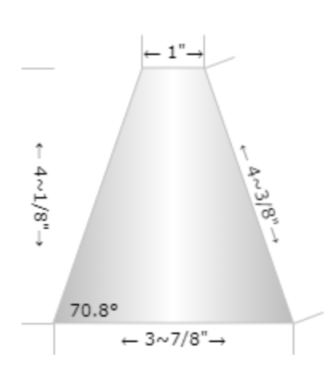

# Playing #FFUTSE - a Freight Frenzy Universal Team Shipping Element

An open source Collaborative Team Shipping Element - this is an open specification for a common team shipping element designed to be highly compatible with capping and stacking requirements, maximizing stability with ease of manipulation, placement and construction. We highly encourage all teams to adopt this Standard.

## For **tldr** slackers:

<a href="#resources">Skip straight to the Downloads and Resources</a>
 <a href="https://forms.gle/p9eFSkRrV8eZk7JB8">Go Sign the Standard</a>

## Standards - It’s not rocket science

Many teams have settled on a cone as the best choice for their team shipping element. But not all cones are equal. It is possible to arrive at a combination of legal designs that are less stable and can be disrupted by shifting/tilting shipping hubs.

**Unstable stack**. Narrow cone on a squat cone. CG is raised. If slick materials are used, the upper cone or entire stack can topple from an aggressively wobbling shipping hub.

With the **highest goal being easy and stable double stacking** - let’s join together and adopt a common but flexible design that will increase the chances of success for all participating teams. This is just a standardizing effort like many technical industries adopt when trying to maximize compatibility. It does not prevent teams from also using more unique designs when they are the only team stacking on a given alliance. We are not subverting the Game Design Committee's challenge, but responding to it in a unified and inclusive way. **It is fully in the spirit of [Coopertition](https://www.firstinspires.org/about/vision-and-mission#:~:text=Coopertition%20is%20founded%20on%20the,Coopertition%20involves%20learning%20from%20teammates.&text=Coopertition%20means%20competing%20always%2C%20but,enabling%20others%20when%20you%20can.)**.

##  Design Requirements

* FFUTSE meets the official sizing and materials requirements - duh!
* FFUTSE should be very stable in its placement on top of the shipping pole. In other words, it should be very unlikely to fall off or shift when the shipping hub wobbles
* FFUTSE is stackable - two of them should nest easily with roughly the same stability and ease of placement as a single element
* FFUTSE is easy to grab - it should be sized as much as possible to be grabbed by the same size/scale of gripper as might operate on the freight elements
* FFUTSE should have additional options for controlling it beyond being friendly to a typical gripper. We do not wish to prescribe a specific method for controlling it
* FFUTSE should be easy to place - this means it should be placeable with limited accuracy requirements and it should be self-centering once minimal accuracy is achieved.
* FFUTSE must not jam in the Sweeper Plate of the Carousel
* FFUTSE should have similar dynamics as a Duck regarding how fast you can spin the Carousel before the element falls off before contacting the sweeper plate. Meaning that if your robot rotates the Carousel just under the speed at which Ducks tend to fly off early, the FFUTSE should at least be modifiable to stick to the Carousel surface at least as well as Ducks. This isn't a primary requirement since we anticipate teams will prefer to place the FFUTSE on the Barcode at the beginning of a match for the doubled bonus points.
* FFUTSE should be easy to make by teams that do not have access to advanced fabrication. For example, it should not require a 3d printer.
* FFUTSE should be durable, or failing access to durable materials, it should be easily rebuilt with low cost materials
* Variants of FFUTSE should be backward compatible with prior official releases 
* Must not be single sourced - a shortcut might be to find a COTS plastic oil funnel at an autoparts chain that can be cut to size. Though candidates could be found - a single model/brand/retailer could cause availability issues for some teams
* Color is not an official part of the specification as many teams will want to customize colors. But we do recommend a light color that contrasts well against various shades of grey tiles. The Duck yellow would work well. For computer vision approaches to sensing the FFUTSE we include:
    * Shape based autonomous visual detection method example
    * Color based visual detection example
    * A Tensor-flow model for V1.1 release
* Official variants include:
    * Pockets for optional neodymium magnets - standardizing on 6x2mm
    * Slot for 15 mm REV extrusion minimum viable gripper at common height
    * Smaller slot for plate-based gripper

Simple open-top cones in a variety of aspect ratios were tested:

Taller elements will be more stable on the pole because the center of mass is further below the point of support. But when too tall, the element might illegally rest on a single layer of freight:

The squat cone combines the maximum allowed bottom opening size with the minimum allowed height and an open top. This was the first paper-based test and it proved to be a good candidate for the final geometry.

## Testing - We’ve done a good amount of testing - Join in!

"/>

* Multiple candidate designs were tested against all of the listed <a href="#designrequirements">Design Requirements</a>
* The squat design works well. It’s got the largest safe opening for sloppy positioning and at just above the minimum height it clears a layer of freight on the top shipping hub level and still has a low enough CG to be very stable. So those the design/dimensions of the release candidate.
* Drop from height test - the open hole plus magnet ballast - this helps prevent the cone from inverting like a shuttlecock. We’ve observed consistent drops from heights well above reasonable conditions and well built FFUTSEs do not rotate or drift.
* Offset drop test - how far aside from center can we drop one onto the pole and each other. If the edge of a cone hits the top of the post encompassing the center point, it’s still likely to fall into place.
* Sliding drop test - drop a cone with forward speed - not been done on a robot yet
* Pulling onto pole with magnets - this works quite well, though it’s only been tested with hand-held magnet rods so far.

## Here’s how you can help

1. Formally adopt the FFUTSE Standard - <a href="https://forms.gle/p9eFSkRrV8eZk7JB8">add your team as a signatory to the Standard</a>. You’ll get the FFUTSE seal that you can print and place on your robot. If you heard about it from an Iron Reign posting, please credit Team 6832 for the referral.
2. Early Adopters sign on to the Standard before the V1.0 official release. You'll be placed on the Early Adopter tier. 
3. Share the standard with other teams you are in contact with. Ask them to mention your team as a referral when they sign op. If you get 3 or more teams to adopt the standard your team will be elevated to the Promoters tier. BE the team that hands out free samples of cone material and maybe even magnets at your next scrimmage or meet. You'll gain even more Outreach cred.
4. Replicate and extend testing, then publish your results tagged as #FFUTSE, then let us know and we’ll help link to your testing. Teams that publically share substantial testing will be recognized on the Certifiers tier.

5. If you discover any concerns with the Standard or recommendations for improvement, open an issue here on the repo. 
6. Share your participation in this project with Judges to get credit for your Outreach.
7. Just for fun, take a stab at the #FFUTSEDropHeightChallenge. Post a video of your team dropping two FFUTSE cones from your maximum height onto an Alliance Shipping Hub pipe (or analog) into a successfully Capped orientation. The video must be continuous - no editing - and less than 30 seconds. You'll need two cones to show successful stacking. It's cool because you'll want a spare anyhow. PLEASE USE COMMON SENSE AND BE SAFE. NO CRAZY LADDER STUFF.

## What’s included in the Standard?

The Standard itself is extremely simple and consists **only** of the following:

* **The geometry of the cone.** To be considered compliant with the standard, the angle of a cone should be 70.8 +/- 2 degrees with a bottom opening of ~3⅞” (98mm) diameter and a top opening of ~1” (25mm) diameter and a height of ~4⅛” (105mm). Those are the **exterior dimensions**. You have some wiggle room with the interior dimensions but your cone needs to stack on the reference cone closely and snuggly.  

* The patterned placement and field orientation of optional magnets is part of the standard.

* Any variations that nest snuggly either on top of or as a base for the reference geometry cone will be considered compliant.
* Teams that adopt the standard but choose to create a variant will agree to also create at least one simple standard cone for testing of nesting.

## Resources and Downloads 
All of the other resources published here are simply **quick-starts for teams**, but they include:

<a href="#flatpat">A reference flat pattern available as PDF, SVG and DWG</a>

<a href="#threed">A reference 3D model available as STL, STEP and F3D</a>

<a href="#materials">Material Options</a>

<a href="#grips">Design variations for easier gripping</a>

<a href="#magnets">Design variation for embedded magnets</a>

<a href="#makeflat"> Flat Pattern Construction Procedure</a>

<a href="#threednotes">3D Printing Notes</a>

 (<a href="#resources">Back to Resources</a>)
 (<a href="#">Back to top</a>)

## Release Candidate Simple Flat Pattern

Note: we firt assumed an overlap/seam tab on only one side would create a weight imbalance, so we should create two identical half patterns. But it turned out that this weight imbalance was negligible for the materials tested and didn’t seem to make a difference in handling. So we settled on a simpler single-seam pattern.

### <a href="resources/FFUTSE_Flat_Pattern_RC1.pdf">Download the PDF</a> PDF was designed to be printed on <b>Letter Paper</b> (8.5"x11") at <b>100% scale</b>. 
<a href="resources/PNG">Download PNGs</a> 
<a href="resources/SVG">Download SVGs</a> 
<a href="resources/DWG">Download DWGs</a> 
FYI: any <B>IMAGE</B> used <B>MUST</B> be sized to a height of 11" to fit the standard!
  (<a href="#resources">Back to Resources</a>)
 (<a href="#">Back to top</a>)

##  3D Model Files

### <a href="resources/FFUTSE_Reference_Cone1mmWall_RC1.stl">Download the Reference Model</a>

 (<a href="#resources">Back to Resources</a>)
 (<a href="#">Back to top</a>)

## Material Options	

* Paper: way too delicate - only for prototyping
* Card Stock (file folders) - cheap, easy to get, semi-durable - would recommend bringing spares to tournaments. Easy to tape or glue together.
* HDPE thin sheet (gallon water/milk jug material) - very durable and flexible, very low friction. This stuff won’t tear easily. Gallon milk or water jugs can be softened in an oven and pressed flat. 
* Polypropylene or Polyethylene sheet material can also be found and harvested from flexible plastic binders or dividers available as office supplies. We are using these: [https://www.amazon.com/AmazonBasics-Tab-Dividers-Pack-Sets/dp/B07K8ZNKZ6](https://www.amazon.com/AmazonBasics-Tab-Dividers-Pack-Sets/dp/B07K8ZNKZ6)
* Low surface energy plastics can be difficult to glue or tape together so we recommend “spot welding” them. We do this by pressing a conical soldering iron into and often through the material to melt two pieces together.
* Many other thin forms of plastic thin sheets are usable but may be harder to find. We do not recommend acrylic/plexiglass.
* 3D Printable - just about any low friction filament should work fine. Teams that can 3D print may be able to better tune desired flexibility vs. rigidity. 3D printed versions should not have noticeable seams.

 (<a href="#resources">Back to Resources</a>)
 (<a href="#">Back to top</a>)

## Optional Gripper Notches

We do not prescribe a specific gripper, intake or cone mechanism. But we recognize that controlling a smooth cone may be challenging and teams need options.

The first option is to grasp a cone through the hole in the top. All of the variants have open cone tops since there is no benefit to closing it. But we think most teams would prefer to grasp it from the outside.

We think about a minimum viable pincer gripper made out of commonly available REV 15mm extrusions. With such a gripper it would be helpful to have vertical faces or at least edges. The most standard height above the field for such a gripper might be the midline (equator) of a Cargo element which is 36mm to the center:

 

Todo: overlay dimensions on above photo

At that height a 15mm extrusion with foam rubber cushions could grab all three freight elements including Ducks (by the head). It’s also possible to adapt the FFUTSE to be retrievable by such a gripper.

<!-- 

Todo: photo of modified cone in simple gripper -->

 (<a href="#resources">Back to Resources</a>)
 (<a href="#">Back to top</a>)

##  Optional Magnetic Mods 

We recommend 4 of [these kinds of 6x2mm neodymium magnets](https://www.amazon.com/FINDMAG-Refrigerator-Magnets-Premium-Whiteboard/dp/B075RZ82HP/ref=sr_1_3?crid=3RBBYF4ICIRYJ&dchild=1&keywords=small+neodymium+magnet+2mm&qid=1632689824&sprefix=small+neodymium+magnet%2Caps%2C183&sr=8-3) spaced evening around the base. Anything larger will likely be too strong, though it will depend on your material choice and thickness.

* Lowers the center of gravity and increases stability
* When a cone is knocked over one magnet will still be fairly easy reach as a way to grab and control the cone
* It’s possible to Place a cone dangling from a single magnet (todo: video)
* Standardize on placing the North end of the magnet pointing out of the cone (todo: diagram)
* Stacked cones can lock together
* If a team makes a mistake in a aligning the magnets, it’s not the end of the world - the cones will rotate to separate repelling magnets as long as there are only 4 spaced evenly around the base
* NEVER place magnets near the tip of the cone - this can foul your partner’s attempts to stack 
* Place magnets on the inside of the cone and secure them well
* Magnets can also be added to a storage location on the robot to help secure the FFUTSE during a match

Q. How do I know which side of the magnets are North? Who has a compass these days?

A. You should have a compass. It’s cool. Your phone probably has one. But you can make your own compass and **Let the Earth tell you**. Take a stack of magnets (you should have at least 5) and rest them in a little boat. You can make the boat from some aluminum foil, a cut plastic spoon, magnets taped to some bubble wrap or foam and place it in a bowl of water that’s not near any other magnets or ferrous metals. The stack will point North - you can figure out North from a street map. The face of the magnet closest to North is considered the North (seeking)  pole of the magnet. (and yes that actually means the North pole on the earth is where the Earth’s field is actually South magnetically) 

 (<a href="#resources">Back to Resources</a>)
 (<a href="#">Back to top</a>)

##  Flat Pattern Construction Procedure

1. Print the pattern(s) on regular paper or cardstock
2. Measure the printed dimensions to be sure it printed at 1:1 scale
3. Transfer the outline with marker or tape pattern to construction material if needed
4. Dashed lines are for optional cut-outs or magnet pockets
5. Cut sheet material with hobby knife or scissors
6. Fold tabs and pockets
7. Tape, glue or weld together. We recommend welding for compatible plastics. Scotch/cellophane tape works well for cardstock
8. Add Team number

This example is constructed of the HDPE sheets sold by Amazon Basics as binder dividers. It comes in many colors, we are using unlikely color choices for initial testing. Deep red would not contrast well with tiles in a color or shape based visual detector. So this cone is for testing shape, dynamics, welding and durability. This one has both gripper notches and magnets - likely it's better to choose just one of those options.

Bending tabs and placing magnets:

It Welds! Tabs are spot-welded into place with a hand held soldering iron:

Completed cone with permanent marker team number:

 (<a href="#resources">Back to Resources</a>)
 (<a href="#">Back to top</a>)

## 3D Printable Version Notes

 (<a href="#resources">Back to Resources</a>)
 (<a href="#">Back to top</a>)

## Rules Reference as of Current FFUTSE Release

The following rules are a subset of rules related to this Standard. This is not a complete listing of TSE rules. Refer to the official game manuals.

4.5.4.4 Capping – For each Team Shipping Element that is fully Supported by the center pole above Level #3 of their Alliance Shipping Hub or by another Capped Team Shipping Element, an Alliance earns fifteen (15) points. 

&lt;TE02> GM1 Size Constraints - The maximum size of the Team Scoring Element is 4 inches (10.16 cm) by 4 inches (10.16 cm) by 8 inches (20.32 cm). The minimum size of the Team Scoring Element is 3 inches (7.62 cm) by 3 inches (7.62 cm) by 4 inches (10.16 cm)

&lt;GS4>c Robots may not Control their opposing Alliance’s Team Shipping Elements. Each violation of this rule results in a Major Penalty. (noted here in case you use a magnetic fishing strategy - be sure to keep your capture magnets away from opposing alliance FFUTSEs that could be knocked across the field)

&lt;GS8> Control/Possession Limits of Scoring Elements - Robots may Control or Possess a maximum of one (1) Freight and one (1) Team Shipping Element at a time. (you can carry it around during a match)

 (<a href="#resources">Back to Resources</a>)
 (<a href="#">Back to top</a>)

